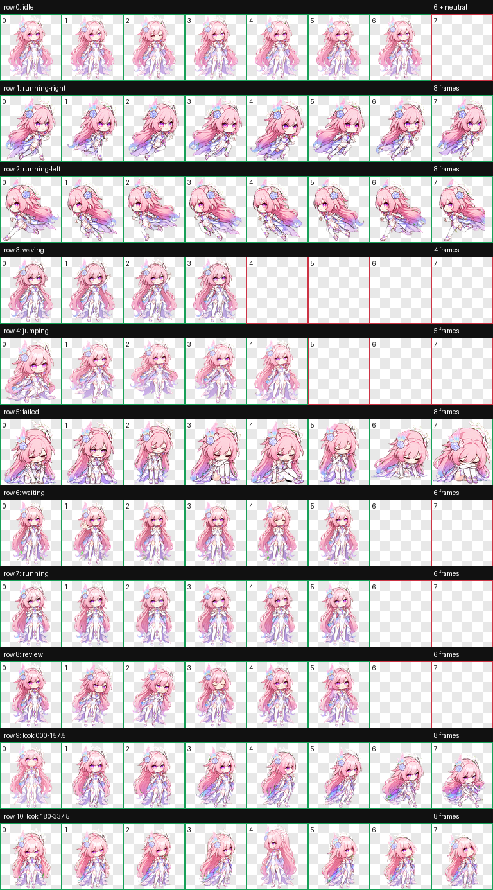
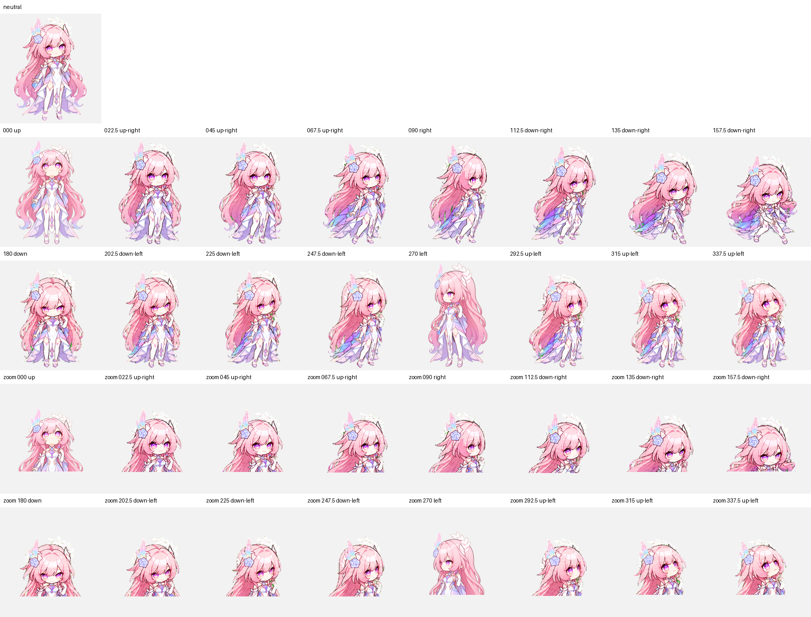

# 昔涟·序 ✦ Cyrene Sequence

> “任务可以慢一点，但结构不能乱。”

她是住在 Codex 角落里的昔涟 Q 版动态宠物，也是一位温柔但很难糊弄的迷你审查者。

当工作顺利时，她会挥手、跳跃，带着一点“我就知道你能做到”的得意；当任务卡住时，她会安静等你决定，不擅自替你做选择。至于混乱的命名、重复的逻辑和悄悄溜进来的不一致——她通常会先盯着看三秒，然后露出那个很有礼貌、但意思非常明确的表情。



## 她为什么叫「序」？

“序”既是顺序，也是秩序。

这个版本以昔涟的粉发、蓝玫瑰、月桂叶、虹彩瞳孔与白紫礼裙为视觉核心，再加入一种更贴近创作者工作习惯的性格：重视结构、复用、一致性与清楚的错误反馈。她不会举着代码或 UI 图标到处跑，这些特质都藏在眼神、动作和停顿里。

她大概会这样评价一段工作：

> “很好看。现在，让我们确认它也真的能用。”

## 小小身体，动作不少

| 状态 | 她在做什么 |
| --- | --- |
| `idle` | 呼吸、眨眼，假装没有在观察你 |
| `running-right` / `running-left` | 跟着任务在屏幕之间赶路 |
| `waving` | 见面打招呼，或者提醒你看看她 |
| `jumping` | 任务顺利时的小幅庆祝 |
| `failed` | 明确告诉你：这一步没有成功 |
| `waiting` | 摊手等待批准、输入或下一步决定 |
| `running` | 专注处理任务，顺手整理胸前晶核 |
| `review` | 成果完成，邀请你进行最终检查 |

此外还有一整圈 16 向注视。无论光标跑到哪个方向，她都能努力跟上——偶尔中间角度会显得含蓄一点，但正上、正右、正下、正左四个基准方向都通过了独立盲测。



## 安装

将 `pet.json` 与 `spritesheet.webp` 放入 Codex 的宠物目录：

```text
~/.codex/pets/cyrene-sequence/
├── pet.json
└── spritesheet.webp
```

Windows PowerShell：

```powershell
$petDir = Join-Path $env:USERPROFILE ".codex\pets\cyrene-sequence"
New-Item -ItemType Directory -Path $petDir -Force | Out-Null
Copy-Item .\pet.json, .\spritesheet.webp -Destination $petDir -Force
```

## 技术规格

- Codex pet schema：v2
- 图集尺寸：1536 × 2288
- 网格：8 列 × 11 行
- 单元格：192 × 208
- 图像格式：RGBA WebP
- 标准动画：9 行
- 注视方向：16 个
- 透明 RGB 残留：0
- 最终视觉验收：通过

更完整的机器校验结果见 [`validation.json`](./validation.json)，生成与验收摘要见 [`run-summary.json`](./run-summary.json)。

## 参考与许可边界

- [Sketchfab：Cyrene by Fella_001](https://sketchfab.com/3d-models/cyrene-615e7f6541ce492fa3db1f05e5438788) 提供可下载的 CC BY 角色模型，作为开放轮廓参考。
- 公开的昔涟 Q 版图片仅用于视觉研究和风格理解，没有作为原始素材重新分发。
- 本仓库中的宠物图集由生成式图像流程重新创作，并经过结构、透明度、动作和方向视觉检查。

详细来源记录见 [`sources.md`](./sources.md)。

---

如果她突然停下来盯着你，不一定是出错了。

也可能只是变量名还没有改成驼峰。
